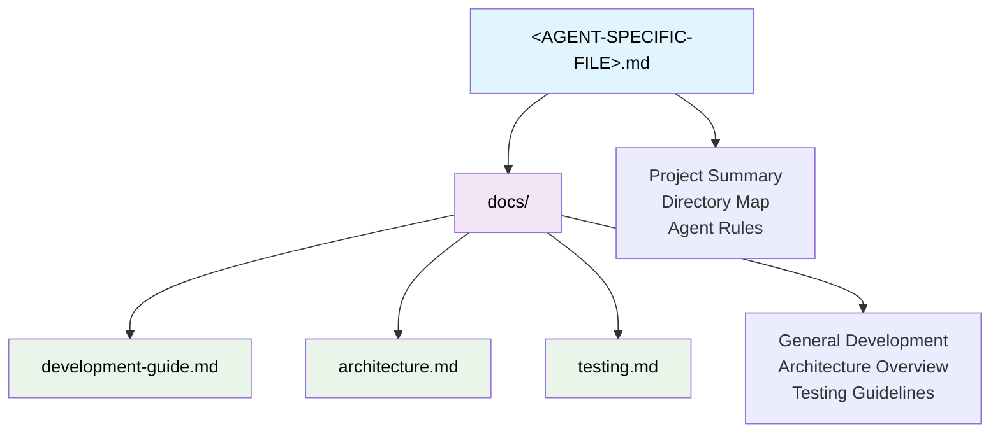
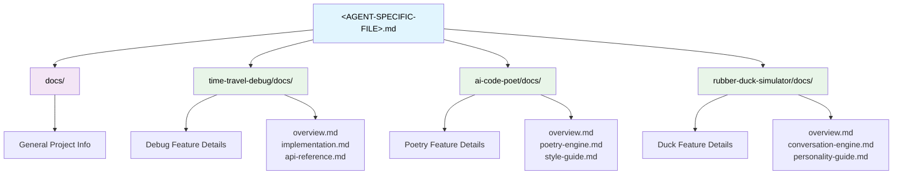

# Basic Tree Methodology

## Required Reading

Before using this methodology, read the [AE Toolkit Glossary](../../GLOSSARY.md) to understand key terminology.

## Overview

The Basic Tree methodology is the most fundamental approach to context management beyond a single tool-specific file. It provides a hierarchical structure that allows AI agents to discover context efficiently through progressive disclosure.

## Core Concepts

### Progressive Disclosure
Information is organized in layers of increasing detail:
- **Agent-specific file**: High-level project overview and navigation map
- **Root docs/**: General project information and development patterns
- **Feature docs/**: Detailed implementation specifics for individual features

### Base Rules Files
The agent-specific file (e.g., `CLAUDE.md`, `.cursorrules`) serves as the entry point:
- Summarizes the project and provides a directory map
- Includes agent behavioral rules ("do what is asked," "take your time")
- Does NOT contain architectural details or code examples
- Guides agents to the right documentation areas

### Flexible Structure
Beyond the tree hierarchy, developers have complete freedom in documentation content and organization.

## Examples

### Simple Example

**When to use**: Small projects, single teams, straightforward architecture

**Directory Structure**:
```
project-root/
├── CLAUDE.md                    # Agent-specific file
├── docs/
│   ├── development-guide.md
│   ├── architecture.md
│   └── testing.md
├── src/
└── package.json
```

**Navigation Flow**:


**Benefits**: 
- Easy to maintain
- Quick navigation for small codebases
- Clear documentation hierarchy

### Detailed Example

**When to use**: Large projects, multiple teams, complex feature sets

**Directory Structure**:
```
project-root/
├── CLAUDE.md                    # Agent-specific file
├── docs/
│   ├── development-guide.md
│   ├── architecture.md
│   └── testing.md
├── time-travel-debug/
│   ├── docs/
│   │   ├── overview.md
│   │   ├── implementation.md
│   │   └── api-reference.md
│   └── src/
├── ai-code-poet/
│   ├── docs/
│   │   ├── overview.md
│   │   ├── poetry-engine.md
│   │   └── style-guide.md
│   └── src/
├── rubber-duck-simulator/
│   ├── docs/
│   │   ├── overview.md
│   │   ├── conversation-engine.md
│   │   └── personality-guide.md
│   └── src/
└── package.json
```

**Navigation Flow**:


**Benefits**:
- Scales to large codebases
- Feature-specific documentation stays organized
- Teams can maintain their own feature docs
- AI can quickly navigate to relevant areas

**Trade-offs**:
- More complex structure to maintain
- Requires discipline to keep organized
- May be overkill for simple projects

## Implementation Guidelines

### Choosing Your Approach

**Use Simple when**:
- Project has < 10 main components
- Single team or small team
- Straightforward architecture
- Limited feature complexity

**Use Detailed when**:
- Project has many distinct features
- Multiple teams working on different areas
- Complex integrations between components
- Need for feature-specific documentation

### Best Practices

1. **Start Simple**: Begin with the simple approach and evolve to detailed as needed
2. **Consistent Naming**: Use consistent naming patterns for documentation files
3. **Clear Navigation**: Always provide clear paths from base rules to specific information
4. **Regular Maintenance**: Keep directory maps updated as the project evolves
5. **Team Alignment**: Ensure all team members understand the documentation structure

### Common Pitfalls

- **Over-engineering**: Don't create deep hierarchies unnecessarily
- **Stale Documentation**: Update navigation maps when adding new features
- **Inconsistent Structure**: Maintain consistent patterns across feature documentation
- **Missing Context**: Always provide enough context for AI to understand the codebase

## Usage Instructions

### For AI Agents

1. **Start with the agent-specific file** (e.g., `CLAUDE.md`) for project overview and navigation
2. **Use the directory map** to identify relevant documentation areas
3. **Navigate to `docs/`** for general project information
4. **Drill down to specific feature documentation** as needed for your task
5. **Follow the progressive disclosure pattern** - don't jump directly to deep implementation details

### For Developers

1. **Create the agent-specific file** with project summary and directory map
2. **Organize general documentation** in root `docs/` folder
3. **Create feature-specific documentation** in feature folders when needed
4. **Maintain clear navigation paths** between documentation levels
5. **Update directory maps** when adding new features or documentation