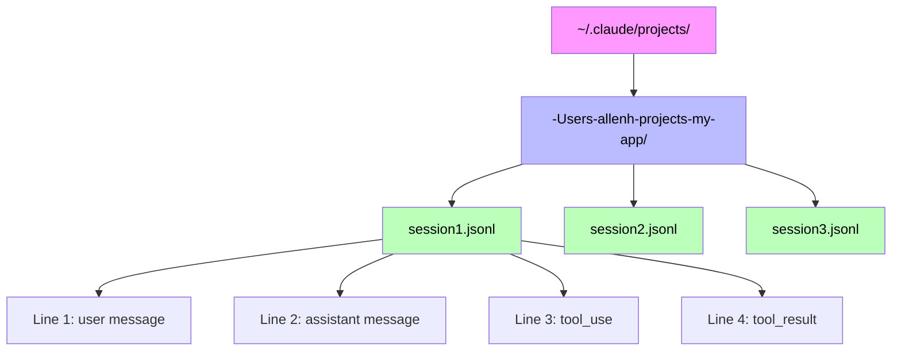
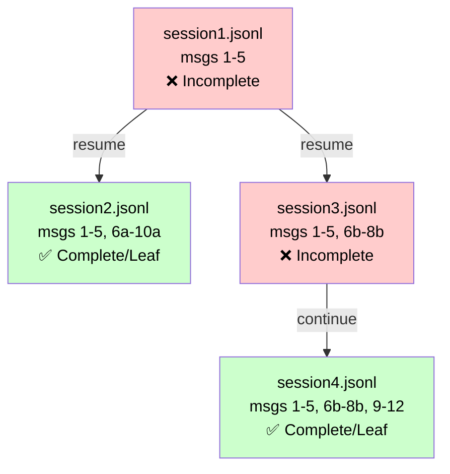
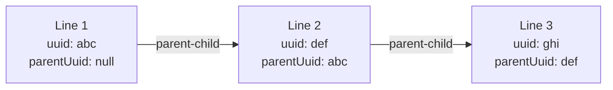
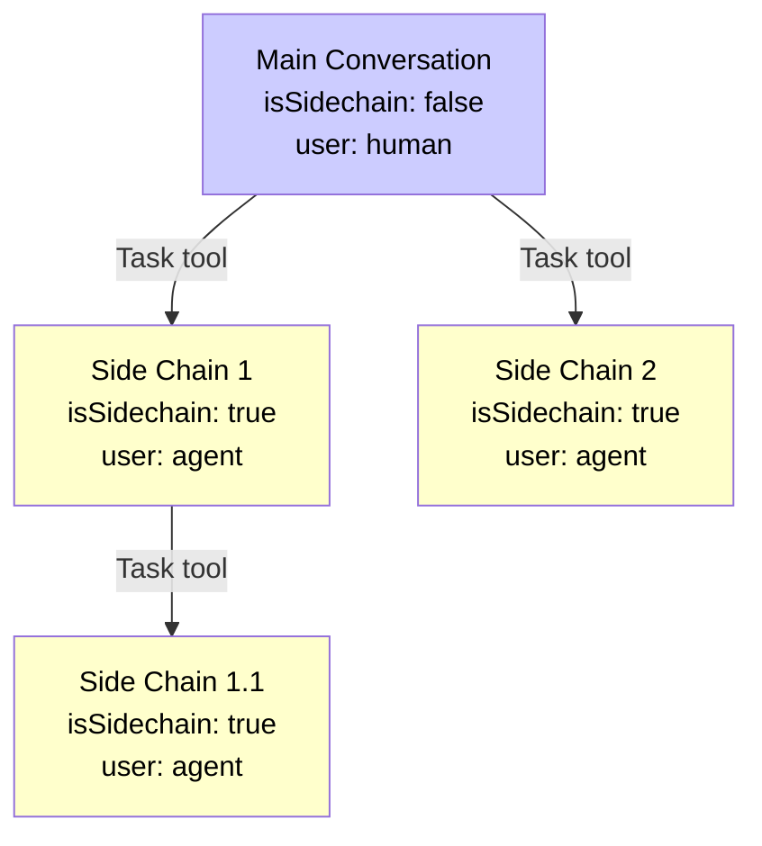

# Claude Code Session History Architecture

This document describes the reverse-engineered structure of Claude Code's local chat history storage system. This information was derived from examining the JSONL files stored locally and understanding their relationships.

## Overview

Claude Code stores conversation history locally on the user's machine in JSONL format (JSON Lines - one JSON object per line). These files are retained for approximately one month before being automatically removed. As far as we can determine, there is no server-side storage or backup mechanism available to users.

**Storage Location:** `~/.claude/projects/`



## Project Directory Naming Scheme

Claude Code uses a lossy escaping algorithm to convert file system paths into directory names:

```
Original Path:           Escaped Directory Name:
/Users/allenh/projects/my-app  →  -Users-allenh-projects-my-app
/Users/allenh/projects-my/app  →  -Users-allenh-projects-my-app  (collision!)
│                           │
└── All "/" become "-" ─────┘
```

The escaping replaces all path separators with hyphens. This approach can potentially lead to namespace collisions since different paths could theoretically produce the same escaped name.

## Session Files

Within each project directory, Claude Code creates JSONL files named after session UUIDs:

```
~/.claude/projects/-Users-allenh-projects-my-app/
├── 755d966a-9cff-43e4-bda7-f2505e6988ce.jsonl
├── c273a987-cd69-40f3-8d0c-05879ae7d59e.jsonl
└── 300c81f3-f983-43ae-a9c2-efc09bb14ec5.jsonl
```

Each file represents a **session**, not necessarily a complete chat conversation.

## Chats vs Sessions: The Complexity

A critical distinction exists between chats and sessions:

- A **chat** is a logical conversation thread
- A **session** is a physical file containing part or all of a chat

### Session Resumption Behavior

When using `claude --resume` to continue a previous conversation:

1. Claude Code creates a **new session file** (new UUID)
2. Previous messages are **copied** into the new file
3. The conversation continues in this new file
4. Minor modifications may occur during the copy process

This leads to several important implications:

- One chat can span multiple session files
- Earlier session files become incomplete representations
- The "complete" chat exists only in the most recent session file of that branch

### Branching Conversations

Users can resume from the same point multiple times, creating branches:

```
Original: session1.jsonl [messages 1-5]
├── Branch A: session2.jsonl [messages 1-5, 6a-10a]
└── Branch B: session3.jsonl [messages 1-5, 6b-8b]
    └── Continued: session4.jsonl [messages 1-5, 6b-8b, 9-12]
```



In this scenario:
- `session1.jsonl` is incomplete (superseded by branches)
- `session2.jsonl` is a complete chat (leaf node)
- `session3.jsonl` is incomplete (continued in session4)
- `session4.jsonl` is a complete chat (leaf node)

## JSONL Line Structure

Each line in a session file is a complete JSON object with this structure:

```json
{
  "uuid": "622d56d3-6423-432c-a08e-a3f1dba02c17",
  "parentUuid": null,
  "sessionId": "ce66e75e-fcad-4818-9c2a-9a25bb03fa4c",
  "timestamp": "2025-09-11T15:11:39.588Z",
  "type": "user",
  "isSidechain": false,
  "userType": "external",
  "cwd": "/Users/allenh/projects/my-app",
  "version": "1.0.111",
  "gitBranch": "main",
  "message": {
    "role": "user",
    "content": [{"type": "text", "text": "Hello"}]
  }
}
```

### Key Fields

- **uuid**: Unique identifier for this specific line/message
- **parentUuid**: References the uuid of the previous message (null for first message)
- **sessionId**: The session this message belongs to (may differ from filename due to resumption)
- **type**: Message type - "user", "assistant", or "summary"
- **isSidechain**: Boolean indicating if this is an agent-to-agent conversation
- **message**: The actual message content in Claude's API format

### Parent-Child Relationship

The `parentUuid` field creates a linked list structure through the conversation:

```
Line 1: uuid="abc", parentUuid=null
Line 2: uuid="def", parentUuid="abc"
Line 3: uuid="ghi", parentUuid="def"
```



This maintains conversation flow even when messages have different sessionIds.

## Tool Usage Architecture

Tool usage in Claude Code involves a two-line pattern that differs from the standard message flow:

### Tool Invocation (Assistant Message)

```json
{
  "type": "assistant",
  "message": {
    "content": [{
      "type": "tool_use",
      "id": "toolu_01YVM3BiaJ3zHePv3oq9zHQR",
      "name": "Read",
      "input": {"file_path": "/path/to/file"}
    }]
  }
}
```

### Tool Result (User Message)

```json
{
  "type": "user",
  "message": {
    "content": [{
      "tool_use_id": "toolu_01YVM3BiaJ3zHePv3oq9zHQR",
      "type": "tool_result",
      "content": "file contents here..."
    }]
  }
}
```

**Critical:** Tool invocations and results are linked via the `tool_use_id` field, NOT through the parentUuid/uuid relationship. This allows for parallel tool execution where multiple tools can be invoked before any results are returned.

**Important Note:** Tool results always appear with `"type": "user"` in the JSONL. This is NOT an error - it's how Claude Code represents the system returning tool results to the assistant. The "user" type here doesn't mean a human user; it means the environment/system providing tool execution results.

**Parallel Execution:** Tool results can appear in any order and are not necessarily on consecutive lines. Results are linked to invocations only by `tool_use_id`.

```
Example parallel tool execution sequence:

Line N:   type="assistant" - tool_use id="toolu_01ABC..." (Read)
Line N+1: type="assistant" - tool_use id="toolu_01DEF..." (Edit)  
Line N+2: type="user" - tool_result tool_use_id="toolu_01DEF..." ← Edit result (faster)
Line N+3: type="user" - tool_result tool_use_id="toolu_01ABC..." ← Read result (slower)

┌─────────────────────────────────────────────────────────┐
│ Assistant invokes tools:                                │
│ ┌─────────────────────────────────────────────────┐     │
│ │ tool_use #1: "toolu_01ABC..." (Read - slow)     │     │
│ └─────────────────────────────────────────────────┘     │
│ ┌─────────────────────────────────────────────────┐     │
│ │ tool_use #2: "toolu_01DEF..." (Edit - fast)     │     │
│ └─────────────────────────────────────────────────┘     │
└─────────────────────────────────────────────────────────┘
                           ↓
┌───────────────────────────────────────────────────────────┐
│ Results arrive in completion order (not invocation):      │
│ ┌───────────────────────────────────────────────────┐     │
│ │ tool_result: "toolu_01DEF..." ← #2 finished first │     │
│ └───────────────────────────────────────────────────┘     │
│ ┌───────────────────────────────────────────────────┐     │
│ │ tool_result: "toolu_01ABC..." ← #1 finished second│     │
│ └───────────────────────────────────────────────────┘     │
└───────────────────────────────────────────────────────────┘
```

## Side Chains (Agent-to-Agent Communication)

When Claude uses the Task tool to spawn sub-agents, it creates a "side chain":

- Lines with `"isSidechain": true` indicate agent-to-agent communication
- In side chains, the "user" is actually another AI agent
- Side chains can be recursive (agents spawning other agents)
- Each side chain maintains its own conversation flow via parentUuid

This creates a tree structure of conversations:

```
Main conversation (isSidechain: false)
├── Side chain 1 (agent task, isSidechain: true)
│   └── Side chain 1.1 (nested agent task, isSidechain: true)
└── Side chain 2 (another agent task, isSidechain: true)
```



## Summary Lines

Summary lines have a special structure:

```json
{
  "type": "summary",
  "leafUuid": "reference-to-last-message-uuid",
  // other fields...
}
```

The `leafUuid` field can reference messages that exist in different session files, enabling cross-file conversation threading. This is particularly important for understanding conversation continuity across resumed sessions.

## Session Resumption and Interleaving

When a session is resumed, interesting patterns emerge:

1. **Message Copying**: Previous messages are copied with minor modifications
2. **SessionId Updates**: Some agent messages get their sessionId updated to the new session's ID (while user messages retain their original sessionId)
3. **Interleaved SessionIds**: Because of #2, a single file contains an alternating pattern of original and new sessionIds

Example within a resumed session file:
```
Resumed Session File: 755d966a-9cff-43e4.jsonl
┌────────────────────────────────────────────────────────┐
│ Line 1: sessionId="ce66e75e..." (user msg, original)   │
│ Line 2: sessionId="755d966a..." (assistant, updated)   │
│ Line 3: sessionId="ce66e75e..." (user msg, original)   │
│ Line 4: sessionId="755d966a..." (assistant, updated)   │
│ Line 5: sessionId="755d966a..." (new messages)         │
└────────────────────────────────────────────────────────┘

Legend:
- ce66e75e = Original session ID (preserved in user messages)
- 755d966a = New session ID (updated in assistant messages, all new messages)
```

This interleaving pattern occurs because assistant messages get their sessionId updated during copying, while user messages retain their original sessionId.

## Data Completeness Considerations

### Session Resumption Behavior Types

Claude Code exhibits **two distinct resumption behaviors** based on the state of the source session:

#### Type 1: Closed Session Resumption (SessionId Overwrite)
When resuming from a **closed/inactive** session:
- Previous messages are copied with **modified sessionIds**
- Historical sessionIds are overwritten with the new session's UUID
- Creates clean linear progression in sessionId arrays

#### Type 2: Open Session Resumption (SessionId Preservation)  
When resuming from an **open/active** session:
- Previous messages are copied with **preserved sessionIds**
- No sessionId overwriting occurs
- Maintains historical context and original session identifiers
- Enables true conversation branching

### Real-World Example

Consider this actual conversation progression:

```
ce66e75e (original)
└── resume (CLOSED) → 755d966a [overwrites: ce66e75e → 755d966a]
    └── resume (CLOSED) → ab337be2 [overwrites: ce66e75e → ab337be2]
        └── resume (OPEN) → 48bfdc96 [overwrites: ce66e75e → 48bfdc96]
            ├── resume (OPEN) → fa2f7873 [preserves: all IDs intact]
            └── resume (OPEN) → 77a00ded [preserves: all IDs intact]
```

**Resulting Session Arrays:**
- `ce66e75e.jsonl`: `[ce66e75e]` ❌ Superseded
- `755d966a.jsonl`: `[755d966a, ce66e75e]` ❌ Superseded  
- `ab337be2.jsonl`: `[755d966a, ab337be2]` ❌ Superseded
- `48bfdc96.jsonl`: `[48bfdc96, ab337be2]` ❌ Superseded (has children)
- `fa2f7873.jsonl`: `[48bfdc96, ab337be2, fa2f7873]` ✅ Complete (leaf)
- `77a00ded.jsonl`: `[48bfdc96, 77a00ded, ab337be2]` ✅ Complete (leaf)

Note: `48bfdc96` was open during branching, which is why both `fa2f7873` and `77a00ded` preserve the original sessionIds instead of overwriting them.

## Known Limitations and Unknowns

### Limitations
- **Lossy Escaping**: The directory naming scheme can cause collisions
- **Local Only**: One-month retention with no cloud backup
- **Fragmentation**: Multiple files for a single logical conversation
- **Incomplete Documentation**: Some JSONL fields remain unexplained

### Unknown Fields
Several fields appear in the JSONL but their exact purpose remains unclear:
- `userType`: Always seems to be "external" - internal types unknown
- `requestId`: Appears to be for API tracking
- Various usage statistics fields in assistant messages

### Data Loss Scenarios
- Sessions older than one month are automatically deleted
- No apparent recovery mechanism for deleted sessions
- Corrupt JSONL files could break entire conversation threads

## Summary

Claude Code's session history architecture is complex, with sessions, chats, and side chains creating a multi-dimensional conversation structure. The system's use of file copying for session resumption, combined with the potential for branching conversations, requires sophisticated parsing to reconstruct complete conversation histories. Understanding these patterns is essential for anyone attempting to analyze or extract Claude Code conversation data.