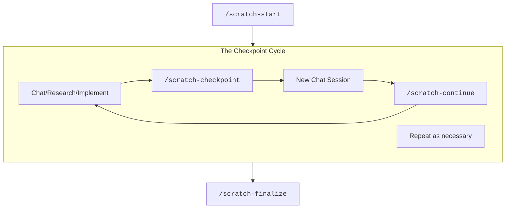

# Scratch Management Utilities

**Tools for implementing a scratch-based workflow that facilitates carrying context across AI chat sessions.**

This module provides commands that help you manage short-term working memory (scratch space) during AI-assisted development. The workflow these tools support facilitates handoff of memory across chat sessions and preserves discoveries that would otherwise need to be re-explained in every new conversation.

## Quick Setup

> **Not sure if this module is right for your situation?** Check the [Getting Started Guide](../getting-started/README.md) for guidance on when to use each toolkit module.

### Installation

**⚠️ IMPORTANT:** You must install the commands BEFORE launching Claude Code. Claude Code doesn't watch the commands directory for changes after startup.

1. **Run the installation script:**
    ```bash
    # Copy files to your project
    ./ae-toolkit/scratch-management-utilities/claude-code/install.sh
    
    # - OR - 

    # create symlinks to the source files
    ./ae-toolkit/scratch-management-utilities/claude-code/install.sh --symlink
    ```

    **Note:** Choose symlinks to reduce duplication in your repo

2. Launch Claude Code
3. **Verify installation** - In Claude Code, type `/scratch-start` and press enter

### Command Reference

| Command | Purpose | When to Use |
|---------|---------|------------|
| `/scratch-start <name>` | Initialize new scratch workspace | Starting multi-session work |
| `/scratch-checkpoint` | Capture current progress | At milestones or before context fills |
| `/scratch-continue` | Load scratch context | Beginning of new chat session |
| `/scratch-finalize` | Promote knowledge to L2 | Scratch work is complete |

## Motivation: The Three-Tier Memory Architecture

The scratch management system uses a three-tier memory architecture inspired by computer memory hierarchies, solving the fundamental problem of context loss between AI sessions:

### Memory Tiers

- **L1 Cache (Scratch Space)**: Temporary, task-specific information that lives only for the duration of a specific implementation effort
  - Current implementation decisions and rationale
  - Active blockers and resolutions
  - Work-in-progress discoveries

- **L2 RAM (Project Documentation)**: Permanent project knowledge that should be available to all future sessions
  - Architectural patterns and decisions
  - Development standards
  - Non-obvious constraints and gotchas

- **L3 Disk (External Systems)**: Organization-wide knowledge that spans multiple projects
  - Compliance requirements
  - Cross-team dependencies
  - Historical decisions

### The Context Window Problem

Every new AI chat session starts with zero context about your previous work. Without scratch management:
- You spend 30-40% of time re-explaining what you already covered
- Important discoveries get lost between sessions
- Technical decisions lack continuity
- The AI suggests approaches you've already rejected

Scratch management solves this by providing a structured handoff mechanism between sessions.

## The Workflow: A Guide

The scratch utilities follow a workflow that you actively manage:



### 

**Starting Work**<br>
When you recognize that upcoming work won't fit in a single chat session, run `/scratch-start <descriptor>` to create a structured workspace. This sets up your scratch area and performs initial research.

**During Implementation**<br>
Work normally while the AI maintains continuity using the scratch context. Monitor your context window usage as you progress.

**Checkpointing**<br>
Run `/scratch-checkpoint` when you hit a milestone or sense context window pressure. This captures your current state, decisions, and discoveries. There are no strict rules here - use your intuition and experience. After checkpointing, start a new chat session.

**Continuing Work**<br>
Begin each new session with `/scratch-continue` to load all context from the scratch workspace. This lets you resume exactly where you left off. The checkpoint → new session → continue cycle can repeat indefinitely.

**Finalizing**<br>
When the scratch has served its purpose, run `/scratch-finalize` to identify valuable discoveries for promotion to L2 documentation and clean up the workspace.

### When to Checkpoint

Knowing when to checkpoint is part art, part science:

1. **Milestones:** It doesn't have to be *every* milestone, but at a milestone boundary is a good place to do it. Milestones are e.g. POC performed, implementation subtask done, finished testing cycle, etc. Any point where you might stop to get a coffee.

2. **Before Context Collapse:** The exact point this happens is not really defined. But if your session gets compacted, then you should've checkpointed earlier. Even before compaction, agents can get pretty goofy as their context window fills up. They start "forgetting" things from earlier in the chat, etc.

### Scratch Size

Scratches can grow large but generally shouldn't end up too large to be used as long as you:
- Focus checkpoint updates on important decisions and discoveries
- Avoid documenting trivial implementation details
- Start fresh scratches for genuinely new work streams

## Platform Support

Currently implemented for:
- ✅ **Claude Code** - Full implementation with all four commands
- 🚧 **GitHub Copilot** - Coming soon
- 🚧 **Cursor** - Coming soon