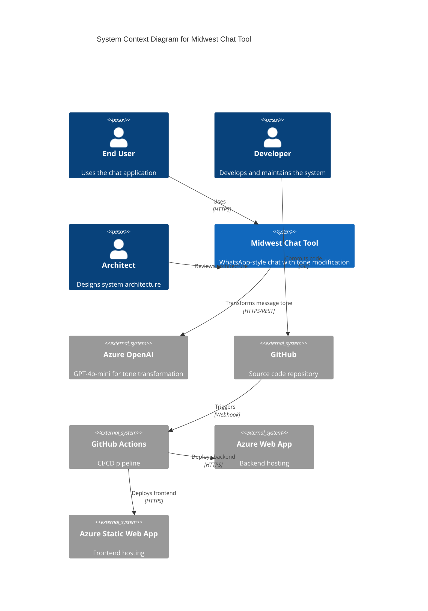

# C1 - System Context Diagram

## Overview

High-level view of the Midwest Chat Tool system and its interactions with users and external systems.

## Diagram

## System Actors

### End User
Users who interact with the chat application to send messages with different tones (funny, playful, serious).

### Developer
Team members who develop and maintain the system using GitHub and AI development tools.

### Architect
System architects who design and document the system architecture.

## External Systems

### Azure OpenAI (GPT-4o-mini)
AI service that transforms message tone based on user selection. Provides funny, playful, and serious tone transformations.

### GitHub
Source code repository hosting the three repositories (context, service, ui).

### GitHub Actions
CI/CD pipeline that automates deployment to Azure services.

### Azure Web App
Hosting platform for the Node.js backend Express service.

### Azure Static Web App
Hosting platform for the React 19 frontend application.

## Key Interactions

- **User to Chat Tool**: HTTPS communication for all user interactions
- **Chat Tool to Azure OpenAI**: REST API calls for tone transformation
- **Developer to GitHub**: Git operations for code management
- **GitHub to GitHub Actions**: Webhook triggers for automated deployments
- **GitHub Actions to Azure**: Deployment of frontend and backend

## Related Diagrams

- [C2 - Container Diagram](./c2-container.md) - Detailed view of system containers
- [C3 - Component Diagram](./c3-component.md) - Component-level architecture
- [C4 - Code Diagram](./c4-code.md) - Code-level patterns
- [Main Architecture](./architecture.md) - Complete architecture overview
