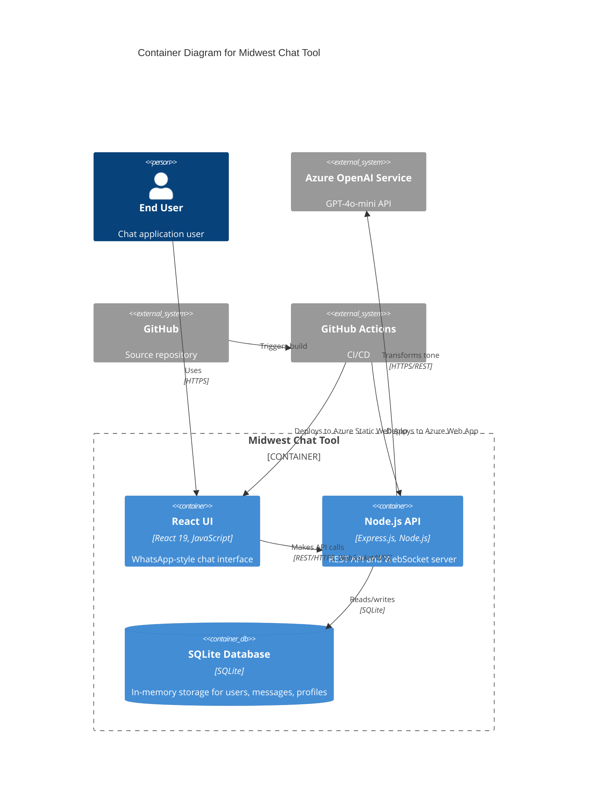

# C2 - Container Diagram

## Overview

Shows the major containers (applications, databases, services) that make up the Midwest Chat Tool system.

## Diagram

## Containers

### React UI

**Technology**: React 19, JavaScript  
**Hosting**: Azure Static Web App  
**Purpose**: WhatsApp-style chat interface

**Key Features**:
- User authentication (username-only)
- Chat conversation list
- Message composition and display
- Tone selection (funny, playful, serious)
- Real-time message updates
- User profile management

**Communication**:
- REST API calls to Node.js API (HTTPS)
- WebSocket connection for real-time messaging (WSS)

### Node.js API

**Technology**: Express.js, Node.js  
**Hosting**: Azure Web App  
**Purpose**: REST API and WebSocket server

**Key Features**:
- User authentication and management
- Message CRUD operations
- Tone transformation integration
- Real-time messaging via Socket.IO
- Chat conversation management

**Endpoints**:
- `/api/auth/*` - Authentication
- `/api/users/*` - User management
- `/api/chat/*` - Chat and messaging
- `/health` - Health check
- WebSocket connections for real-time updates

**Communication**:
- Serves REST API to React UI
- Queries SQLite database
- Calls Azure OpenAI for tone transformation

### SQLite Database

**Technology**: SQLite (In-memory)  
**Purpose**: Data storage for POC

**Data Entities**:
- Users (username, profile, online status)
- Messages (content, tone, timestamps)
- Conversations (participants, metadata)

**Characteristics**:
- In-memory storage (data resets on restart)
- Simple POC-level persistence
- Fast read/write operations

## External Systems

### Azure OpenAI Service

**Service**: GPT-4o-mini  
**Purpose**: Message tone transformation

Transforms user messages into different tones based on selection (funny, playful, serious).

### GitHub

**Purpose**: Source code repository

Hosts three repositories:
- `midwest-7-context` - AI instruction hub
- `midwest-7-service` - Backend Node.js service
- `midwest-7-ui` - Frontend React application

### GitHub Actions

**Purpose**: CI/CD pipeline

Automates deployment:
- Frontend to Azure Static Web App
- Backend to Azure Web App

## Deployment Architecture

### Azure Static Web App

Hosts the React UI with:
- Static file serving
- HTTPS termination
- Global CDN distribution

### Azure Web App

Hosts the Node.js API with:
- Express.js runtime
- WebSocket support
- HTTPS termination
- Auto-scaling capabilities

## Related Diagrams

- [C1 - System Context](./c1-system-context.md) - High-level system view
- [C3 - Component Diagram](./c3-component.md) - Component-level architecture
- [C4 - Code Diagram](./c4-code.md) - Code-level patterns
- [Main Architecture](./architecture.md) - Complete architecture overview
