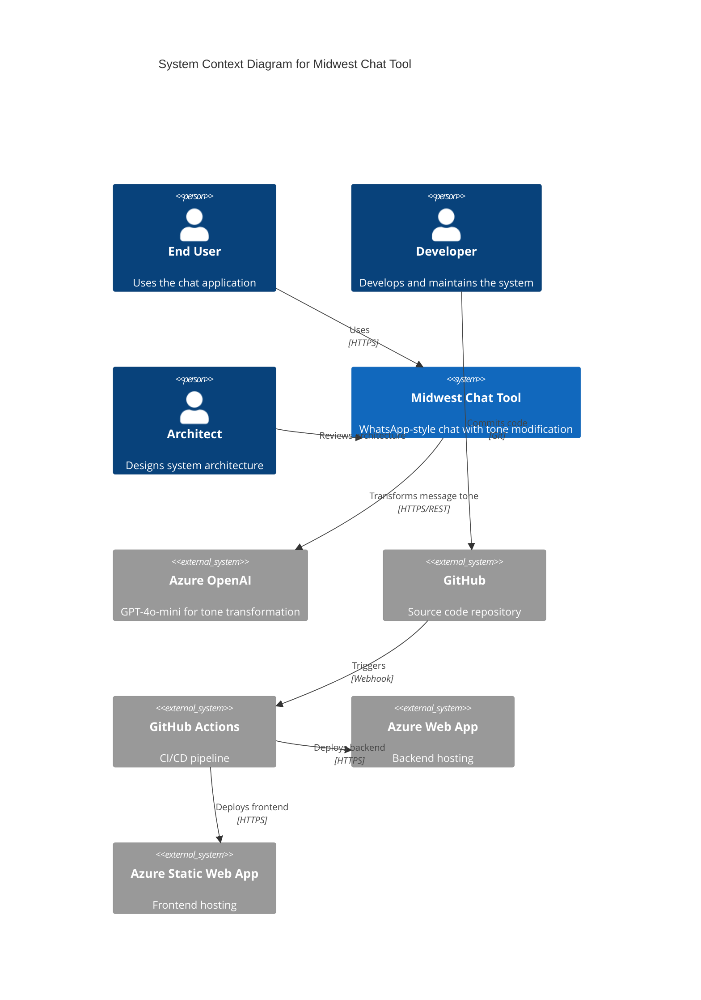
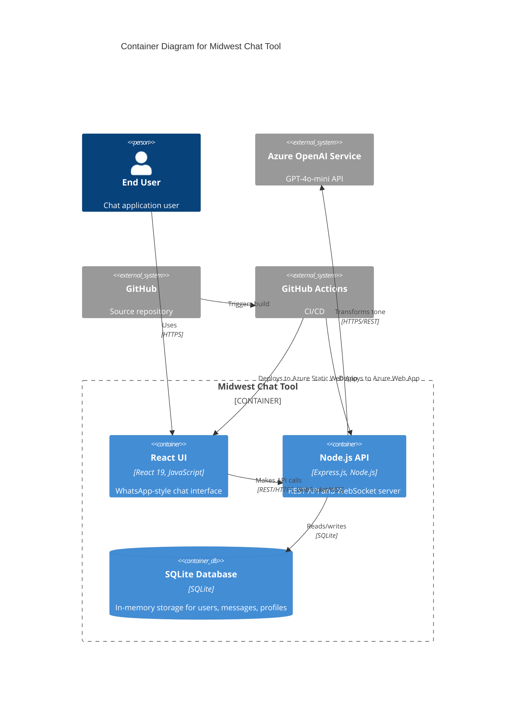
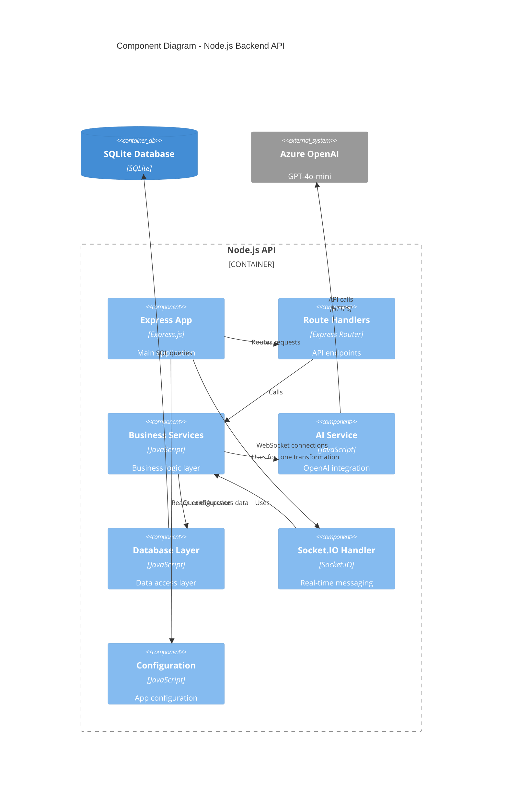
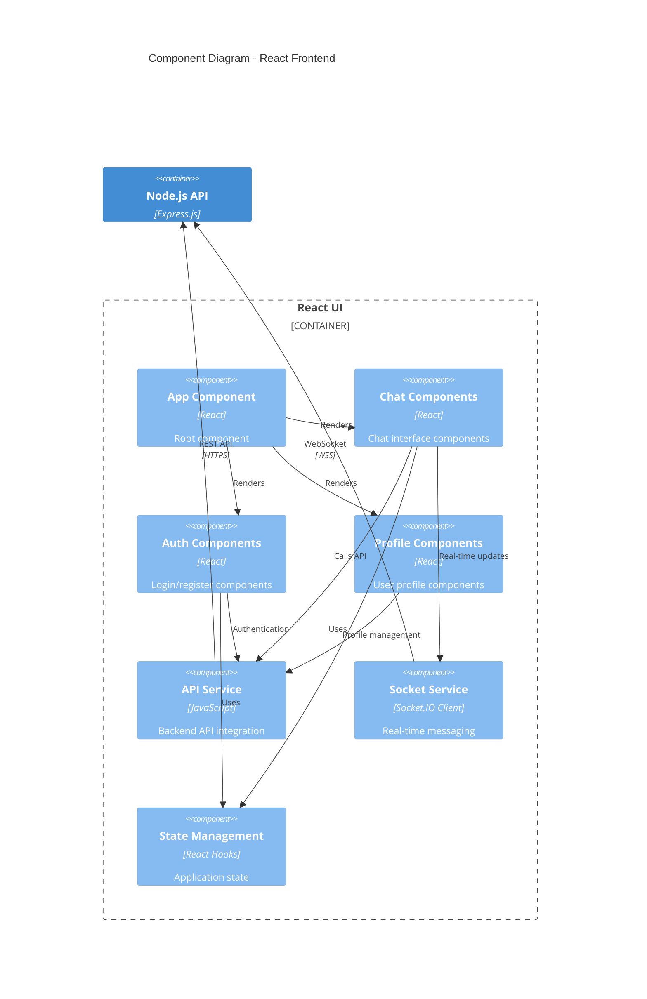

# Implementation Plan: Story 66666 - Update Architecture Diagrams Using C4

## Implementation Overview

This implementation will create comprehensive C4 architecture documentation across all three repositories using Mermaid diagram syntax. The work is organized into phases to ensure systematic coverage of all architecture levels.

---

## Phase 1: Analysis & Review

### Step 1.1: Review Current Architecture Documentation
**Files to review:**
- `midwest-7-context/docs/architecture.md`
- `midwest-7-service/docs/architecture.md`
- `midwest-7-ui/docs/architecture.md`

**Actions:**
1. Read and analyze existing architecture documentation
2. Identify current system components, containers, and interactions
3. Note any gaps or outdated information
4. Document deployment architecture (Azure Web App, Static Web App, etc.)

### Step 1.2: Analyze Backend Codebase
**Repository:** `midwest-7-service`

**Key areas to review:**
- `app.js` - Main application entry point
- `routes/` - API endpoints and routing structure
- `services/` - Business logic and AI integration
- `db/` - Database layer and models
- `config/` - Configuration including AI and Socket.io

**Document:**
- API endpoints and their purposes
- Service layer components
- Database schema and relationships
- External integrations (Azure OpenAI GPT-4o-mini)
- WebSocket/real-time features

### Step 1.3: Analyze Frontend Codebase
**Repository:** `midwest-7-ui`

**Key areas to review:**
- `src/` - React component structure
- `src/components/` - UI components
- `src/services/` - API integration services
- State management approach
- Routing structure

**Document:**
- Main React components and hierarchy
- API service integration patterns
- State management approach
- User interaction flows

---

## Phase 2: Create C1 - System Context Diagrams

### Step 2.1: Create C1 for midwest-7-context
**File:** `midwest-7-context/docs/c1-system-context.md`

**Content structure:**
```markdown
# C1 - System Context Diagram

## Overview
High-level view of the Midwest Chat Tool system and its interactions with users and external systems.

## Diagram


```

### Step 2.2: Create C1 for midwest-7-service
**File:** `midwest-7-service/docs/c1-system-context.md`

**Same content as Step 2.1** (system context is consistent across repos)

### Step 2.3: Create C1 for midwest-7-ui
**File:** `midwest-7-ui/docs/c1-system-context.md`

**Same content as Step 2.1** (system context is consistent across repos)

---

## Phase 3: Create C2 - Container Diagrams

### Step 3.1: Create C2 for midwest-7-context
**File:** `midwest-7-context/docs/c2-container.md`

**Content structure:**
```markdown
# C2 - Container Diagram

## Overview
Shows the major containers (applications, databases, services) that make up the Midwest Chat Tool.

## Diagram


```

### Step 3.2: Create C2 for midwest-7-service
**File:** `midwest-7-service/docs/c2-container.md`

**Same content as Step 3.1** (container view is consistent)

### Step 3.3: Create C2 for midwest-7-ui
**File:** `midwest-7-ui/docs/c2-container.md`

**Same content as Step 3.1** (container view is consistent)

---

## Phase 4: Create C3 - Component Diagrams

### Step 4.1: Create C3 for midwest-7-service (Backend Components)
**File:** `midwest-7-service/docs/c3-component.md`

**Content structure:**
```markdown
# C3 - Component Diagram (Backend)

## Overview
Shows the internal components of the Node.js API backend service.

## Diagram



## Key Components

### Route Handlers
- User routes (authentication, profiles)
- Message routes (send, receive, list)
- Chat routes (conversations, tone modification)

### Business Services
- User service (registration, authentication)
- Message service (CRUD operations)
- Tone transformation service
- Real-time messaging service

### AI Service
- OpenAI client wrapper
- Tone transformation logic (funny, playful, serious)
- Error handling and retries

### Database Layer
- User data access
- Message data access
- Conversation management
- SQLite connection pooling
```

### Step 4.2: Create C3 for midwest-7-ui (Frontend Components)
**File:** `midwest-7-ui/docs/c3-component.md`

**Content structure:**
```markdown
# C3 - Component Diagram (Frontend)

## Overview
Shows the internal components of the React UI application.

## Diagram



## Key Components

### Chat Components
- ChatList (conversation list)
- ChatWindow (message display)
- MessageInput (compose messages)
- ToneSelector (select message tone)

### Auth Components
- Login form
- Registration form
- Username validation

### Profile Components
- UserProfile display
- Profile editor
- User discovery

### API Service
- HTTP client wrapper
- Request/response handling
- Error handling
- Authentication token management

### Socket Service
- WebSocket connection management
- Real-time message handling
- Connection state management
```

### Step 4.3: Create C3 for midwest-7-context
**File:** `midwest-7-context/docs/c3-component.md`

**Content:** Reference to both backend and frontend C3 diagrams with links

---

## Phase 5: Create C4 - Code Diagrams

### Step 5.1: Create C4 for midwest-7-service
**File:** `midwest-7-service/docs/c4-code.md`

**Focus on key code patterns:**
- AI service integration pattern
- Database access patterns
- Socket.IO event handling
- Express middleware chain

### Step 5.2: Create C4 for midwest-7-ui
**File:** `midwest-7-ui/docs/c4-code.md`

**Focus on key code patterns:**
- React component hierarchy
- Custom hooks patterns
- API service integration
- State management patterns

### Step 5.3: Create C4 for midwest-7-context
**File:** `midwest-7-context/docs/c4-code.md`

**Content:** Overview and links to specific code diagrams

---

## Phase 6: Update Architecture.md Files

### Step 6.1: Update midwest-7-context/docs/architecture.md
Add navigation section:
```markdown
## Architecture Documentation

This document provides an overview of the system architecture. For detailed views at different levels, see:

- [C1 - System Context](./c1-system-context.md) - High-level view of the system and external interactions
- [C2 - Container Diagram](./c2-container.md) - Major containers and their relationships
- [C3 - Component Diagram](./c3-component.md) - Internal components within containers
- [C4 - Code Diagram](./c4-code.md) - Detailed code-level patterns

### C4 Model Overview

The C4 model provides a hierarchical way to visualize software architecture:

1. **Level 1 - System Context**: Shows how the system fits into the world
2. **Level 2 - Containers**: Shows the high-level technical building blocks
3. **Level 3 - Components**: Shows how containers are made up of components
4. **Level 4 - Code**: Shows how components are implemented (optional)

Start with C1 for high-level understanding, then drill down to C2, C3, and C4 as needed.
```

### Step 6.2: Update midwest-7-service/docs/architecture.md
Add the same navigation section as Step 6.1

### Step 6.3: Update midwest-7-ui/docs/architecture.md
Add the same navigation section as Step 6.1

---

## Phase 7: Update Copilot Instructions

### Step 7.1: Update midwest-7-context/.github/copilot-instructions.md

Add new section after "Session Management":

```markdown
### Architecture Diagram Maintenance
- **ALWAYS review architecture diagrams** when a story is completed
- Check if changes impact any of the C4 levels (System Context, Container, Component, Code)
- **REQUIRED**: Get user confirmation before updating architecture diagrams
- Update relevant C4 diagram files if:
  - New containers or components are added
  - External system integrations change
  - Communication patterns or protocols change
  - Deployment architecture changes
- Keep diagrams synchronized across all three repositories (context, service, ui)
- Ensure Mermaid syntax remains valid after updates
```

### Step 7.2: Update midwest-7-service/.github/copilot-instructions.md

Add the same section under Core AI Behavior Rules

### Step 7.3: Update midwest-7-ui/.github/copilot-instructions.md

Add the same section under Core AI Behavior Rules

---

## Testing & Validation

### Diagram Rendering Test
1. Preview each C1-C4 markdown file in VS Code
2. Verify Mermaid diagrams render correctly
3. Check for syntax errors in Mermaid code
4. Validate that all relationships and components are shown

### Accuracy Validation
1. Compare diagrams to actual codebase
2. Verify Azure deployment details match reality
3. Check that all external integrations are shown
4. Ensure component relationships are accurate

### Cross-Repository Consistency
1. Verify C1 diagrams are identical across all repos
2. Verify C2 diagrams are identical across all repos
3. Check that C3 diagrams correctly represent respective repositories
4. Ensure architecture.md updates are consistent

### Link Validation
1. Test all links in architecture.md files
2. Verify navigation between C1-C4 works
3. Check that relative paths are correct

---

## Implementation Checklist

### Phase 1: Analysis ✅
- [ ] Review context architecture.md
- [ ] Review service architecture.md
- [ ] Review ui architecture.md
- [ ] Analyze backend codebase structure
- [ ] Analyze frontend codebase structure
- [ ] Document current system architecture

### Phase 2: C1 System Context ✅
- [ ] Create context/docs/c1-system-context.md
- [ ] Create service/docs/c1-system-context.md
- [ ] Create ui/docs/c1-system-context.md
- [ ] Verify diagrams render correctly

### Phase 3: C2 Container ✅
- [ ] Create context/docs/c2-container.md
- [ ] Create service/docs/c2-container.md
- [ ] Create ui/docs/c2-container.md
- [ ] Verify diagrams render correctly

### Phase 4: C3 Component ✅
- [ ] Create service/docs/c3-component.md (backend)
- [ ] Create ui/docs/c3-component.md (frontend)
- [ ] Create context/docs/c3-component.md (overview)
- [ ] Verify diagrams render correctly

### Phase 5: C4 Code ✅
- [ ] Create service/docs/c4-code.md
- [ ] Create ui/docs/c4-code.md
- [ ] Create context/docs/c4-code.md
- [ ] Verify diagrams render correctly

### Phase 6: Update Architecture.md ✅
- [ ] Update context/docs/architecture.md
- [ ] Update service/docs/architecture.md
- [ ] Update ui/docs/architecture.md
- [ ] Test all navigation links

### Phase 7: Update Copilot Instructions ✅
- [ ] Update context/.github/copilot-instructions.md
- [ ] Update service/.github/copilot-instructions.md
- [ ] Update ui/.github/copilot-instructions.md

### Final Validation ✅
- [ ] All 12 C4 files created
- [ ] All Mermaid diagrams render
- [ ] Cross-repository consistency verified
- [ ] Links tested
- [ ] User confirmation obtained

---

## Notes

- Use Mermaid C4 diagram syntax for consistency
- Keep diagrams simple and focused on architecture, not implementation details
- Ensure all three repositories stay synchronized
- Get user feedback on diagram accuracy before finalizing
- Remember: C1 and C2 should be identical across repos; C3 and C4 are repo-specific
