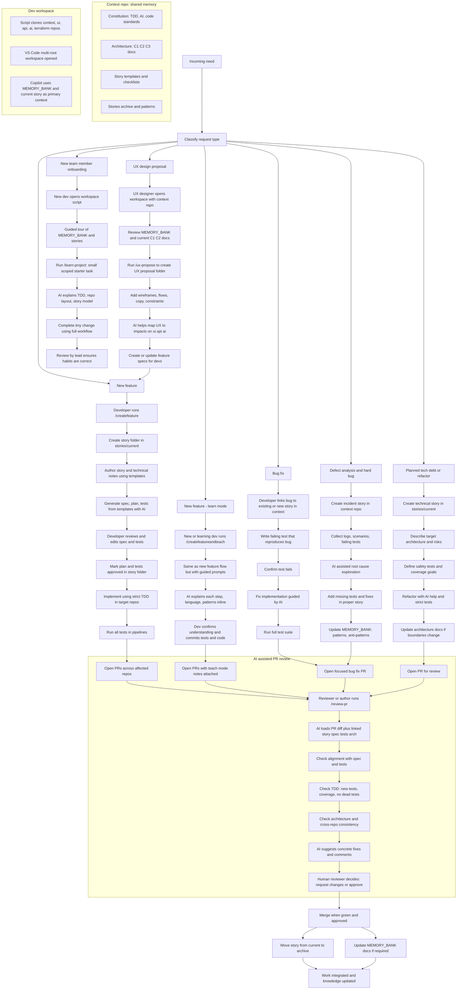

```mermaid
flowchart TD

  %% Core assets
  subgraph MEMORY_BANK[Context repo: shared memory]
    MB1[Constitution: TDD, AI, code standards]
    MB2[Architecture: C1 C2 C3 docs]
    MB3[Story templates and checklists]
    MB4[Stories archive and patterns]
  end

  subgraph WORKSPACE[Dev workspace]
    WS1[Script clones context, ui, api, ai, terraform repos]
    WS2[VS Code multi-root workspace opened]
    WS3[Copilot uses MEMORY_BANK and current story as primary context]
  end

  Start[Incoming need]
  Start --> Classify[Classify request type]

  Classify --> NF[New feature]
  Classify --> NFLearn[New feature - learn mode]
  Classify --> Bug[Bug fix]
  Classify --> UX[UX design proposal]
  Classify --> Onboard[New team member onboarding]
  Classify --> Defect[Defect analysis and hard bug]
  Classify --> TechDebt[Planned tech debt or refactor]

  %% NEW FEATURE (STANDARD)
  NF --> NF1[Developer runs /createfeature]
  NF1 --> NF2[Create story folder in stories/current]
  NF2 --> NF3[Author story and technical notes using templates]
  NF3 --> NF4[Generate spec, plan, tests from templates with AI]
  NF4 --> NF5[Developer reviews and edits spec and tests]
  NF5 --> NF6[Mark plan and tests approved in story folder]
  NF6 --> NF7[Implement using strict TDD in target repos]
  NF7 --> NF8[Run all tests in pipelines]
  NF8 --> PRNew[Open PRs across affected repos]

  %% NEW FEATURE LEARN MODE
  NFLearn --> L1[New or learning dev runs /createfeatureandteach]
  L1 --> L2[Same as new feature flow but with guided prompts]
  L2 --> L3[AI explains each step, language, patterns inline]
  L3 --> L4[Dev confirms understanding and commits tests and code]
  L4 --> PRLearn[Open PRs with teach mode notes attached]

  %% BUG FIX
  Bug --> B1[Developer links bug to existing or new story in context]
  B1 --> B2[Write failing test that reproduces bug]
  B2 --> B3[Confirm test fails]
  B3 --> B4[Fix implementation guided by AI]
  B4 --> B5[Run full test suite]
  B5 --> PRBug[Open focused bug fix PR]

  %% UX DESIGNER MODE
  UX --> UX1[UX designer opens workspace with context repo]
  UX1 --> UX2[Review MEMORY_BANK and current C1 C2 docs]
  UX2 --> UX3[Run /ux-propose to create UX proposal folder]
  UX3 --> UX4[Add wireframes, flows, copy, constraints]
  UX4 --> UX5[AI helps map UX to impacts on ui api ai]
  UX5 --> UX6[Create or update feature specs for devs]
  UX6 --> NF

  %% NEW TEAM MEMBER ONBOARDING
  Onboard --> O1[New dev opens workspace script]
  O1 --> O2[Guided tour of MEMORY_BANK and stories]
  O2 --> O3[Run /learn-project: small scoped starter task]
  O3 --> O4[AI explains TDD, repo layout, story model]
  O4 --> O5[Complete tiny change using full workflow]
  O5 --> O6[Review by lead ensures habits are correct]

  %% DEFECT ANALYSIS (HARD BUG OR INCIDENT)
  Defect --> D1[Create incident story in context repo]
  D1 --> D2[Collect logs, scenarios, failing tests]
  D2 --> D3[AI assisted root cause exploration]
  D3 --> D4[Add missing tests and fixes in proper story]
  D4 --> D5[Update MEMORY_BANK: patterns, anti-patterns]
  D5 --> PRBug

  %% TECH DEBT AND REFACTORING
  TechDebt --> T1[Create technical story in stories/current]
  T1 --> T2[Describe target architecture and risks]
  T2 --> T3[Define safety tests and coverage goals]
  T3 --> T4[Refactor with AI help and strict tests]
  T4 --> T5[Update architecture docs if boundaries change]
  T5 --> PRTech[Open PR for review]

  %% PR REVIEW WORKFLOW (APPLIES TO ALL PR TYPES)
  subgraph PR_REVIEW[AI assisted PR review]
    PRNew --> R1
    PRLearn --> R1
    PRBug --> R1
    PRTech --> R1

    R1[Reviewer or author runs /review-pr]
    R1 --> R2[AI loads PR diff plus linked story spec tests arch]
    R2 --> R3[Check alignment with spec and tests]
    R3 --> R4[Check TDD: new tests, coverage, no dead tests]
    R4 --> R5[Check architecture and cross-repo consistency]
    R5 --> R6[AI suggests concrete fixes and comments]
    R6 --> R7[Human reviewer decides: request changes or approve]
  end

  %% MERGE AND MEMORY UPDATE
  R7 --> Merge[Merge when green and approved]
  Merge --> U1[Move story from current to archive]
  Merge --> U2[Update MEMORY_BANK docs if required]
  U1 --> End[Work integrated and knowledge updated]
  U2 --> End
```